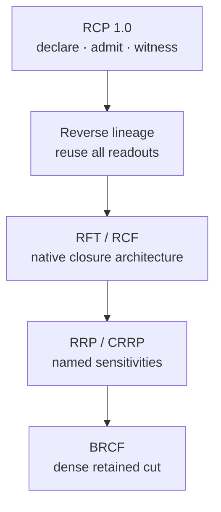
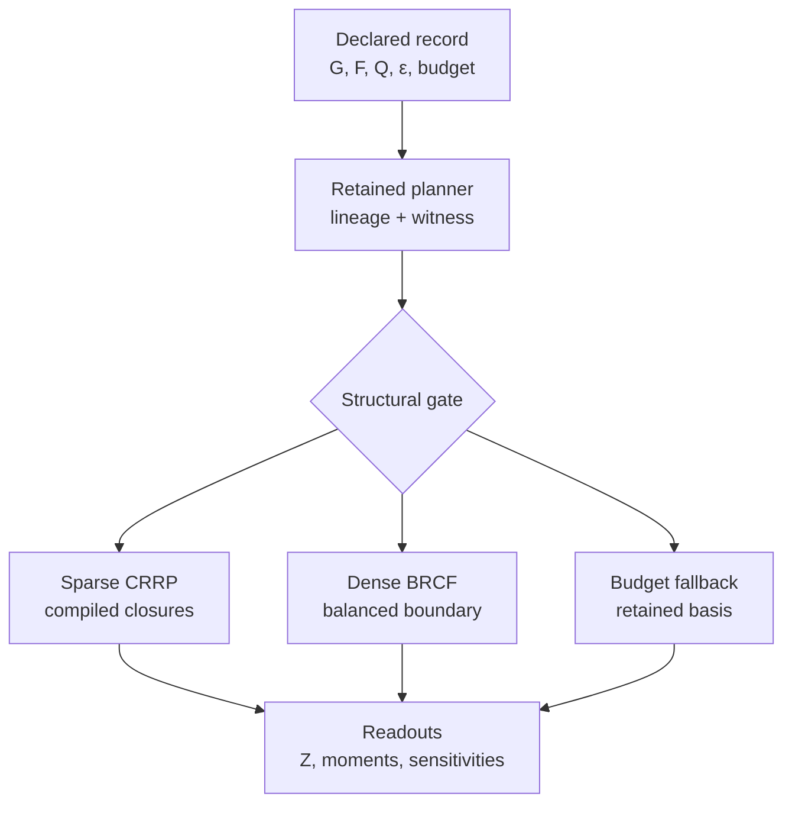

# วิวัฒนาการคณิตศาสตร์ของสถาปัตยกรรม RCP

## จาก Retained Contraction Protocol 1.0 ถึง Balanced Retained-Cut Fusion

**สถานะเอกสาร:** standalone mathematical architecture report  
**ขอบเขต:** สถาปัตยกรรมการคำนวณแบบ finite retained readout  
**จุดเริ่มใน repository:** commit `32efbb2`  
**รากเชิงปรัชญา:** `Dr`  
**ราก FTCC:** `Th_coqc`  
**ตัว executor, preservation test และ benchmark:** `finite_diagnostic`  
**ข้ออ้างเชิงฟิสิกส์:** ไม่มี  
**ข้ออ้างว่าเร็วที่สุดทุกกรณี:** ไม่มี

---

## บทคัดย่อ

Retained Contraction Protocol (RCP) เริ่มจากข้อกำหนดว่าเครื่องจักรไม่ควร
สร้าง global state space ก่อนรู้ว่าผู้ใช้ต้องการอ่านอะไร วัตถุตั้งต้นจึงไม่ใช่
full tensor แต่เป็น finite retained record ซึ่งระบุ distinctions, local
couplings, terminal readouts, tolerance และ resource budget ล่วงหน้า

สถาปัตยกรรมพัฒนาผ่านลำดับต่อไปนี้:

1. **RCP 1.0:** สัญญา finite contraction และ fail-closed certificate;
2. **Repeated retained contraction:** คำนวณ \(Z\) และแต่ละ moment แยกกัน;
3. **Retained Reverse Lineage:** forward หนึ่งครั้งและ reverse หนึ่งครั้ง;
4. **Query-Pruned Reverse:** ตัด adjoint ที่ไม่ถึง terminal readout;
5. **Retained Fold Tree (RFT):** นิยาม closure node และ relevance unfold
   จาก retained boundary โดยตรง;
6. **Retained Closure Fusion (RCF):** รวม consecutive closures เฉพาะเมื่อ
   boundary ไม่ขยาย;
7. **Retained Readout Pullback (RRP):** เปลี่ยน gradient เป็น declared
   sufficient-statistic readout;
8. **Weighted-Gram RRP:** อ่าน pair statistics หลายรายการจาก environment
   เดียว;
9. **Compiled RRP (CRRP):** compile finite loops โดยไม่เปลี่ยนความหมาย;
10. **Topology-only retained plan:** แยก structural plan ออกจาก parameter
    values;
11. **Balanced Retained-Cut Fusion (BRCF):** แบ่ง dense graph เป็นสอง
    retained blocks และอ่านทุก within/cross statistic จาก mass matrix เดียว;
12. **Adaptive native executor:** เลือก sparse CRRP, dense BRCF หรือ
    resource-gated fallback จากโครงสร้างที่ประกาศ

หัวใจที่ไม่เปลี่ยนตลอดทุกเวอร์ชันคือ:

\[
\boxed{\text{retain only distinctions that can still change a declared readout}}
\]

---

## 1. รากคณิตศาสตร์สารสนเทศ

### 1.1 คำตอบคือ retained readout

หลักทั่วไปของสถาปัตยกรรมคือ

\[
r=O_\varepsilon(X)\cdot\delta_R,
\]

เมื่อ

- \(X\) คือ finite record ที่เข้าถึงได้;
- \(\delta_R\) คือความต่างที่ยังถูกเก็บและจึงยังอ่านได้;
- \(O_\varepsilon\) คือ readout ที่ประกาศพร้อม resolution/tolerance;
- \(r\) คือคำตอบที่ boundary

สมการนี้เป็นหลักการของการเลือกสิ่งที่คำนวณ ไม่ใช่สูตร numerical kernel
เพียงสูตรเดียว

### 1.2 FTCC เป็น fold root

แกน telescoping ที่ machine-checked คือ

\[
I_\varepsilon(D_\varepsilon f)=f[N]-f[0].
\]

ความหมายเชิงสถาปัตยกรรมคือ internal distinctions สามารถถูกปิดด้วย finite
ordered fold ตราบเท่าที่ terminal boundary difference ยังถูกรักษา

FTCC ให้รูปแบบของการ fold แต่ยังไม่เท่ากับ theorem ว่า Python tensor
executor ทุกตัวถูกต้อง การพิสูจน์ preservation ของ factor contraction
ทั้งเส้นทางยังเป็นงาน formal ที่แยกออกไป

### 1.3 กฎ non-contamination

เครื่องมือภายนอกใช้เป็น comparator หรือ execution lesson ได้ แต่ไม่ถูกนำมา
เป็น primitive ของ ontology:

- Junction Tree ไม่ใช่รากของ RFT/RCF;
- autodiff tape ไม่ใช่รากของ RRP;
- JAX/XLA ไม่ใช่ dependency ของ native compiled executor;
- BLAS เป็น arithmetic substrate ไม่ใช่นิยามของ readout

ความเหมือนเชิงผลลัพธ์บนปัญหา finite บางชนิดคือ extensional agreement
ไม่ใช่การประกาศว่ารากฐานทั้งสองเหมือนกัน

---

## 2. ปัญหา finite ร่วมของทุกเวอร์ชัน

ให้

\[
G_R=(V_R,E_R,s)
\]

เป็น retained coupling hypergraph โดย

- \(V_R\) คือ finite named distinctions;
- \(E_R\) คือ finite factor scopes;
- \(s(v)\in\mathbb N_{>0}\) คือจำนวน states ของ distinction \(v\)

ให้ local records เป็น

\[
F=\{f_e:Q_e\rightarrow\mathbb R\}_{e\in E_R},
\qquad
Q_e=\prod_{v\in e}\{0,\ldots,s(v)-1\}.
\]

global product ที่เป็นไปได้คือ

\[
T(x)=\prod_{e\in E_R}f_e(x_e),
\]

แต่ RCP ไม่ถือว่า \(T\) ต้องถูก materialize

สำหรับ scalar partition:

\[
Z=\sum_{x\in Q_V}T(x).
\]

สำหรับ axis first moment:

\[
\mu_i
=
\frac{1}{Z}
\sum_{x\in Q_V}x_iT(x).
\]

สำหรับ pairwise exponential family ที่ใช้ใน benchmark:

\[
T_{\alpha,\beta}(x)
=
\prod_i w_i(x_i)e^{-\alpha_i x_i}
\prod_{e=(i,j)}e^{-\beta_e x_i x_j}.
\]

terminal query รุ่นล่าสุดคือ

\[
Q=
\left(
Z,\{\mu_i\}_i,
\left\{\frac{\partial Z}{\partial\theta_k}\right\}_k,
\left\{\frac{\partial\log Z}{\partial\theta_k}\right\}_k
\right),
\]

เมื่อ

\[
\theta=(\alpha_1,\ldots,\alpha_d,\beta_1,\ldots,\beta_{|E|}).
\]

---

## 3. Version map

| รุ่นสถาปัตยกรรม | retained object หลัก | ปัญหาที่แก้ |
|---|---|---|
| RCP 1.0 | declaration + path + certificate | การคำนวณไม่มี boundary/budget/witness ชัดเจน |
| Repeated contraction | local factors + reused order | ยังสร้าง full tensor น้อยลง แต่คำนวณซ้ำตามจำนวน readouts |
| Reverse lineage | finite contraction DAG | reuse forward computation สำหรับทุก moment |
| Query-pruned reverse | terminal relevance cone | ไม่สร้าง pair-factor adjoints ที่ไม่มีผู้ใช้ |
| RFT | closure event + boundary record | สร้าง native architecture จาก closure/readout |
| RCF | fused boundary-neutral closure | ลด Python/node overhead และ witness reconstruction |
| RRP | named sufficient statistic | อ่าน parameter sensitivity โดยไม่สร้าง general adjoints |
| Weighted-Gram RRP | retained coordinate basis | รวม pair readouts จาก environment เดียว |
| CRRP | compiled finite closure program | ลด interpreter overhead |
| Topology-only plan | structure/value separation | เปลี่ยน coefficients โดยไม่ replan |
| BRCF | balanced cross-boundary mass | ลด dense factor-by-factor state-space passes |
| Adaptive RRP | explicit structural gate | เลือก representation ตาม sparse/dense regime |

### 3.1 Historical status

RCP 1.0 และ reverse compiler ปรากฏใน repository history ที่ commit
`32efbb2` ส่วน Query-Pruned Reverse, RFT, RCF, RRP, CRRP และ BRCF ในรายงานนี้
คือสายพัฒนาปัจจุบันใน working tree ที่ผ่าน tests/benchmarks แล้ว แต่ยังไม่ควร
ถูกเรียกว่า published release หรือ Git commit จนกว่าจะมีการ commit/push
อย่างชัดเจน

---

## 4. รุ่นแรก: RCP 1.0

### 4.1 Retained record

RCP รุ่นแรกกำหนดวัตถุ

\[
\mathcal R_\lambda
=
\left(G_R,F,B,Q,\varepsilon,\mathcal B\right),
\]

โดย

- \(B\subseteq V_R\) คือ exposed boundary;
- \(Q\) คือ output names/readouts ที่สัญญา;
- \(\varepsilon\) คือ finite comparison tolerance;
- \(\mathcal B\) คือ work/storage envelope

internal distinctions คือ

\[
I=V_R\setminus B.
\]

### 4.2 Admissible closure path

path ที่ยอมรับได้ต้องเป็น permutation ของ internal distinctions ทุกตัว:

\[
p=(v_1,\ldots,v_{|I|}).
\]

มันต้องไม่

- ปิด boundary distinction;
- ปิด distinction ซ้ำ;
- ทิ้ง internal distinction โดยไม่ปิด

planner อาจหา

\[
p^\*
=
\arg\min_{p\in P_{\mathrm{adm}}(G_R)}
\left(
\operatorname{Work}(p),
\operatorname{PeakRetained}(p)
\right).
\]

RCP ไม่อ้างว่า min-fill คือ optimizer ที่ดีที่สุดเสมอ Min-fill เป็นเพียง
deterministic admissible planner ที่ implementation ปัจจุบันใช้

### 4.3 หนึ่ง elimination step

สำหรับ distinction \(v\) ให้ bucket

\[
F_v=\{f\in F:v\in\operatorname{scope}(f)\}
\]

และ joined scope

\[
J_v=\bigcup_{f\in F_v}\operatorname{scope}(f).
\]

boundary ที่เหลือหลังปิด \(v\) คือ

\[
B_v=J_v\setminus\{v\}.
\]

record ใหม่คือ

\[
m_v(x_{B_v})
=
\sum_{x_v}
\prod_{f\in F_v}f(x_{\operatorname{scope}(f)}).
\]

### 4.4 เหตุผลที่ one-step closure รักษาคำตอบ

เขียน factors ที่ไม่อยู่ใน bucket เป็น \(H\) ซึ่งไม่ขึ้นกับ \(x_v\) นอก
variables ที่แชร์ผ่าน \(B_v\) เนื่องจากทุกเซตเป็น finite:

\[
\sum_{x_{V}}
\left(
\prod_{f\in F_v}f
\right)H
\]

\[
=
\sum_{x_{V\setminus\{v\}}}
\left[
\sum_{x_v}
\prod_{f\in F_v}f
\right]H
\]

\[
=
\sum_{x_{V\setminus\{v\}}}
m_v(x_{B_v})H.
\]

นี่คือ finite distributivity/reassociation ไม่มีการเรียก completed limit

ถ้าแต่ละ step รักษา boundary readout การทำ induction ตาม path ให้

\[
C_p(F)=Z.
\]

ใน repository ปัจจุบัน identity นี้ถูกตรวจด้วย executable witness แต่ theorem
ทั่วไปที่ bind กับ Python lineage ยังไม่ได้ machine-check

### 4.5 Certificate mathematics

สำหรับ finite diagnostic:

\[
\delta_\lambda(C_p,C_w)
=
\max_k|C_p[k]-C_w[k]|
\le\varepsilon.
\]

พร้อมตรวจ

\[
\operatorname{Work}_{\rm measured}
=
\operatorname{Work}_{\rm planned}
\]

และ

\[
\operatorname{PeakRetained}(p)
\le \mathcal B_{\rm storage}.
\]

ผลลัพธ์มีสามสถานะ:

- `ACCEPT`: declaration, budget, ledger และ witness ผ่าน;
- `HOLD`: มี output แต่หลักฐานยังไม่พอ;
- `BLOCK`: path/declaration/resource contract ผิด

---

## 5. รุ่น repeated retained contraction

รุ่น coupled compiler แรกคำนวณ

\[
Z=C_p(F)
\]

หนึ่งครั้ง แล้วคำนวณ numerator ของแต่ละ moment ด้วย modified unary factor:

\[
N_i
=
C_p\!\left(
F\setminus\{u_i\}
\cup\{x_i u_i\}
\right).
\]

ดังนั้น

\[
\mu_i=N_i/Z.
\]

ข้อดีคือไม่สร้าง full tensor และ reuse elimination order ได้ แต่สำหรับ
\(d\) moments ต้องทำ contraction ประมาณ \(d+1\) ครั้ง:

\[
T_{\rm repeated}
\approx(d+1)T_{\rm contraction}.
\]

ถ้า induced width คือ \(w\) และแต่ละ axis มี \(q\) states:

\[
T_{\rm repeated}
=
O\!\left(d^2q^{w+1}\right)
\]

ใน benchmark family ที่มีจำนวน steps เป็น \(O(d)\)

รุ่นนี้จึงลด representation cost แต่ยังไม่ลด repeated-query cost

---

## 6. Retained Reverse Lineage

### 6.1 Forward DAG

execute admitted path ครั้งเดียว:

\[
Z=C_p(F).
\]

ทุก closure บันทึก

\[
\mathcal S_v=(v,J_v,F_v,m_v).
\]

ลำดับ \(\{\mathcal S_v\}\) เป็น finite causal DAG ของการคำนวณจริง

### 6.2 Reverse finite chain rule

ให้ terminal relevance เป็น

\[
\bar Z=1.
\]

ถ้า \(m_v\) ถูกใช้ภายหลังและได้รับ incoming relevance
\(\bar m_v\), relevance ของ factor เป้าหมาย \(g\in F_v\) คือ

\[
\bar g(x_{\operatorname{scope}(g)})
=
\sum_{x_{J_v\setminus\operatorname{scope}(g)}}
\bar m_v(x_{B_v})
\prod_{\substack{f\in F_v\\f\ne g}}
f(x_{\operatorname{scope}(f)}).
\]

นี่เป็น finite product-and-sum identity แม้มีรูปเหมือน reverse-mode
autodiff

### 6.3 Moment readout จาก unary relevance

สำหรับ unary record

\[
u_i(k)=w_i(k)e^{-\alpha_i x_i(k)}
\]

มี

\[
\frac{\partial Z}{\partial u_i(k)}
=
\sum_{x_{-i}}
\prod_{e\ne u_i}f_e.
\]

ดังนั้น

\[
N_i
=
\sum_k x_i(k)u_i(k)
\frac{\partial Z}{\partial u_i(k)}
\]

และ

\[
\mu_i=N_i/Z.
\]

ทุก moment จึงออกจาก forward หนึ่งรอบและ reverse หนึ่งรอบ

### 6.4 Complexity

ให้ \(b_v=|F_v|\) และ \(|J_v|\le w+1\) งาน forward โดยประมาณคือ

\[
W_\uparrow
=
\sum_v O\!\left(b_vq^{|J_v|}\right).
\]

reverse ที่สร้าง adjoint ทุก input มีงาน

\[
W_\downarrow
=
\sum_v O\!\left(b_v^2q^{|J_v|}\right).
\]

จึงคง exponential dependence ที่ width:

\[
O\!\left(d\,b^2q^{w+1}\right),
\]

แต่ไม่คูณด้วยจำนวน readouts อีกชั้น

---

## 7. Query-Pruned Reverse

Reverse lineage รุ่นแรกสร้าง adjoint ให้ pair factor ทุกตัว แม้ terminal query
มีเพียง \(Z\) และ unary first moments

กำหนด dependency cone ของ query:

\[
\operatorname{Cone}(Q)
=
\{r:\exists\text{ causal path }r\rightsquigarrow Q\}.
\]

กฎ pruning คือ

\[
r\notin\operatorname{Cone}(Q)
\Longrightarrow
\text{ไม่สร้าง relevance record ของ }r.
\]

สำหรับ query แรก:

- generated closure records ต้องอยู่ต่อ เพราะนำ relevance ไปยังอดีต;
- unary factors ต้องอยู่ เพราะใช้สร้าง \(\mu_i\);
- original pair-factor adjoints เป็น terminal dead ends จึงตัดได้

ถ้า \(t_v\le b_v\) คือจำนวน targets ที่ยัง relevant:

\[
W_{\downarrow,\rm pruned}
=
\sum_v O\!\left(t_vb_vq^{|J_v|}\right).
\]

ความถูกต้องตาม query เกิดจากทุก record ที่ถูกตัดไม่มี causal path ไปยัง
readout ที่ประกาศ การตัดจึงเปลี่ยน unrequested internal representation
แต่ไม่เปลี่ยน \(Q\)

---

## 8. Retained Fold Tree

RFT สร้าง native object ใหม่จาก closure semantics แทนการมอง executor เป็น
generic adjoint graph

### 8.1 Closure node

\[
\mathcal C_v=(v,B_v,F_v,m_v)
\]

โดย

\[
m_v(i_{B_v})
=
\sum_{i_v}
\prod_{f\in F_v}f(i_{\operatorname{scope}(f)}).
\]

node หมายถึง “distinction \(v\) ถูกปิดและ boundary record นี้รอด” ไม่ใช่
maximal clique

### 8.2 Causal edge

\[
\mathcal C_u\longrightarrow\mathcal C_v
\]

ก็ต่อเมื่อ \(m_u\) ถูกใช้ใน bucket \(F_v\) edge จึงถือ produced record
ไม่ใช่ calibrated separator

### 8.3 Upward fold

\[
(F_v,v)\mapsto m_v(B_v)
\]

ทำต่อเนื่องจนได้

\[
Z=\operatorname{FoldUp}(F).
\]

### 8.4 Downward terminal-relevance unfold

ให้ \(a_v(B_v)\) เป็น terminal relevance จาก consumer ของ \(m_v\)
local environment คือ

\[
E_v(i_v,i_{B_v})
=
a_v(i_{B_v})
\prod_{f\in F_v}f(i_{\operatorname{scope}(f)}).
\]

axis mass:

\[
\rho_v(i_v)
=
\sum_{i_{B_v}}E_v(i_v,i_{B_v}).
\]

first moment:

\[
\mu_v
=
\frac{\sum_{i_v}x_v(i_v)\rho_v(i_v)}{Z}.
\]

เฉพาะ generated child contexts ที่ยังมี readout dependency ถูกส่งลงต่อ
จึงได้ query pruning เป็นส่วนหนึ่งของ object definition ไม่ใช่ optimization
ภายหลัง

---

## 9. Retained Closure Fusion

RFT หนึ่ง-axis-per-node ถูกต้องแต่มี Python overhead และอาจ reconstruct
environment หลายครั้ง

ให้ consecutive closure block เป็น

\[
B=(v_1,\ldots,v_k).
\]

fused closure คือ

\[
\mathcal F_B
=
I_\varepsilon
\left(
\prod_{v\in B}D_v
\right)
\Bigm|_{\partial_R B}.
\]

fusion ยอมรับได้เมื่อ

1. ไม่มี intermediate readout อยู่ระหว่าง axes;
2. การเพิ่ม axis ถัดไปไม่ทำให้ joined retained scope โต;
3. fused record ไม่เกิน 16,384 elements;
4. retained witnesses อยู่ใน budget

เงื่อนไขหลักคือ boundary neutrality:

\[
\partial_R(v_1,\ldots,v_j)
=
\partial_R(v_1,\ldots,v_{j+1})
\]

สำหรับ fusion step ที่ยอมรับ

เมื่อไม่มี readout คั่น finite associativity/distributivity ให้

\[
\operatorname{Fold}(v_{j+1},\operatorname{Fold}(v_j,F))
=
\operatorname{Fold}((v_j,v_{j+1}),F)
\]

ที่ terminal boundary

### 9.1 Retained witness quotient

บน positive factor domain ถ้า joint witness คือ

\[
J_C=\prod_{f\in F_C}f,
\]

context สำหรับ child \(g\) อ่านได้จาก

\[
E_{C\rightarrow g}
=
a_C\frac{J_C}{g}
\]

แทนการคูณ siblings ใหม่ทุกตัว เงื่อนไข positivity/nonzero สำคัญ เพราะ
quotient ไม่ปลอดภัยทั่วไปเมื่อ factor เป็นศูนย์

---

## 10. Retained Readout Pullback

RRP เปลี่ยนคำถามจาก “ต้องสร้าง adjoint array ใดบ้าง” เป็น “terminal
sensitivity ต้องอ่าน sufficient statistic ใด”

### 10.1 Exponential-family identity

สำหรับ

\[
Z(\theta)
=
\sum_x
\exp\!\left(-\sum_k\theta_kT_k(x)\right)W_0(x),
\]

finite differentiation ของผลรวม finite ให้

\[
\frac{\partial Z}{\partial\theta_k}
=
-\sum_xT_k(x)
\exp\!\left(-\sum_j\theta_jT_j(x)\right)W_0(x).
\]

ดังนั้น

\[
\frac{\partial Z}{\partial\theta_k}
=
-N_k,
\qquad
\frac{\partial\log Z}{\partial\theta_k}
=
-\frac{N_k}{Z}
=
-E[T_k].
\]

สำหรับ benchmark:

\[
T_{\alpha_i}(x)=x_i,
\qquad
T_{\beta_{ij}}(x)=x_ix_j.
\]

จึงได้

\[
\partial_{\alpha_i}\log Z=-E[x_i],
\]

\[
\partial_{\beta_{ij}}\log Z=-E[x_ix_j].
\]

### 10.2 Local closure readout

ที่ closure \(C\):

\[
E_C(x_C)
=
a_C(x_{\partial C})
\prod_{f\in F_C}f(x_{\operatorname{scope}(f)}).
\]

ถ้า statistic \(T_k\) ถูก consumed ที่ closure นี้:

\[
N_k
=
\sum_{x_C}T_k(x_C)E_C(x_C).
\]

RRP จึง retain scalar/vector statistic ที่ query ตั้งชื่อ ไม่สร้าง general
factor adjoint ที่ terminal ไม่อ่าน

---

## 11. Weighted-Gram multi-readout

RRP รุ่นแรกอ่าน pair moment แยกทีละ edge:

\[
N_{ij}
=
\sum_xx_ix_jp(x).
\]

เมื่อ closure เดียวมี active coordinates \(i=1,\ldots,k\), สร้าง
value-independent coordinate basis

\[
B=
\begin{bmatrix}
x_1(1)&\cdots&x_1(N)\\
\vdots&&\vdots\\
x_k(1)&\cdots&x_k(N)
\end{bmatrix}.
\]

สำหรับ closure mass vector \(p\):

\[
G=(B\odot p)B^\mathsf T.
\]

แล้ว

\[
G_{ij}
=
\sum_{n=1}^N x_i(n)x_j(n)p_n
=
N_{ij}.
\]

นี่คือ batch ของ declared second-order readouts ไม่ใช่ Jacobian

resource gate:

\[
kN\le524{,}288
\]

float elements มิฉะนั้นใช้ local reductions

---

## 12. Compiled Retained Readout Program

CRRP แยก semantics ออกจาก execution substrate:

\[
\text{retained plan}
\xrightarrow{\text{lower}}
\text{finite array maps and loops}
\xrightarrow{\text{compile}}
\text{native machine code}.
\]

Numba/LLVM compile เฉพาะ loops ที่ planner ประกาศแล้ว มันไม่

- หา gradient;
- สร้าง tape;
- เลือก contraction ontology;
- สร้าง Junction Tree

ดังนั้นถ้า \(P\) คือ retained plan และ \(L(P)\) คือ lowered loop program
ข้อกำหนดคือ

\[
\operatorname{Readout}(P,\theta)
=
\operatorname{Execute}(L(P),\theta)
\]

ภายใน declared binary64 tolerance

asymptotic complexity ไม่เปลี่ยน แต่ interpreter/dispatch constants ลดลง

---

## 13. Topology-only retained compilation

plan identity รุ่นแรกผูกกับ `PairwiseProblem` ทั้งก้อน ซึ่งรวม parameter
values ทำให้ coefficients ใหม่อาจสร้าง cache entry ใหม่ทั้งที่โครงสร้างเดิม

รุ่นแก้ไขกำหนด

\[
K_{\rm plan}
=
\left(
d,\{(i,j)\}_{e\in E},q,\nu_{\rm plan}
\right),
\]

โดยไม่รวม

\[
\alpha,\beta\notin K_{\rm plan}.
\]

จึงแยก

\[
\text{structure}
\quad\perp\quad
\text{runtime values}.
\]

สำหรับ parameter records

\[
\theta^{(1)},\ldots,\theta^{(m)}
\]

ที่ topology เดียวกัน:

\[
P=P(K_{\rm plan})
\]

ถูกสร้างครั้งเดียว แล้ว

\[
r^{(j)}=\operatorname{Execute}(P,\theta^{(j)}).
\]

structural witness รายงาน plan version, dimensions, closure count, largest
joint และยืนยันว่า parameter values ไม่อยู่ใน key

---

## 14. Balanced Retained-Cut Fusion

### 14.1 ปัญหา dense รุ่นก่อน

บน complete graph:

\[
|E|=\frac{d(d-1)}{2}.
\]

factor-by-factor full-closure construction วิ่งผ่าน \(q^d\) states หลายครั้ง
และมี work scale โดยคร่าว

\[
W_{\rm old,dense}
=
O(|E|q^d)
=
O(d^2q^d).
\]

ถึง weighted-Gram จะรวม readout แล้ว forward factor construction ยังเป็น
bottleneck

### 14.2 Balanced retained partition

แบ่ง distinctions เป็น

\[
V=L\sqcup R,
\qquad
\bigl||L|-|R|\bigr|\le1.
\]

ให้

\[
X_L\in\mathbb R^{q^{|L|}\times|L|},
\qquad
X_R\in\mathbb R^{q^{|R|}\times|R|}
\]

เป็น finite state-coordinate records

แยก energy:

\[
E(x_L,x_R)
=
E_L(x_L)+E_R(x_R)+x_L^\mathsf TB_{LR}x_R.
\]

กำหนด retained block scores:

\[
s_L(u)=\log w_L(u)-E_L(u),
\]

\[
s_R(v)=\log w_R(v)-E_R(v).
\]

cross-boundary mass:

\[
M_{uv}
=
\exp\!\left(
s_L(u)+s_R(v)
-X_L(u)^\mathsf TB_{LR}X_R(v)
\right).
\]

### 14.3 Exactness

mapping

\[
x\longleftrightarrow(u,v)
\in Q_L\times Q_R
\]

เป็น finite bijection เพราะ \(V=L\sqcup R\) ดังนั้น

\[
\sum_{x\in Q_V}T(x)
=
\sum_{u\in Q_L}\sum_{v\in Q_R}M_{uv}
=
\mathbf1^\mathsf TM\mathbf1.
\]

นี่ไม่ใช่ approximation หรือ low-rank truncation

### 14.4 Readouts

row/column masses:

\[
r=M\mathbf1,
\qquad
c=M^\mathsf T\mathbf1.
\]

axis numerators:

\[
N_L=X_L^\mathsf Tr,
\qquad
N_R=X_R^\mathsf Tc.
\]

cross-pair numerators:

\[
N_{LR}=X_L^\mathsf TMX_R.
\]

within-block pair numeratorsอ่านจาก cached feature matrices:

\[
\Phi_L(u,e)=x_i(u)x_j(u),
\qquad e=(i,j)\subseteq L,
\]

\[
N_{E_L}=\Phi_L^\mathsf Tr,
\]

และเหมือนกันสำหรับ \(R\)

gradient ทั้งหมดจึงเป็น

\[
\nabla_\theta Z=-N,
\qquad
\nabla_\theta\log Z=-N/Z.
\]

### 14.5 Complexity

ให้

\[
n_L=q^{|L|},
\qquad
n_R=q^{|R|},
\qquad
n_Ln_R=q^d.
\]

cross energy และ cross moments ใช้ matrix products:

\[
X_LB_{LR}X_R^\mathsf T,
\qquad
X_L^\mathsf TMX_R.
\]

balanced widths ให้ work หลัก

\[
W_{\rm BRCF}
=
O(dq^d)
\]

พร้อม output size \(O(d^2)\), เทียบกับ factor-by-factor dense work

\[
O(d^2q^d).
\]

BRCF ยัง exponential ใน \(d\) และไม่ได้แก้ generic dense exact inference
ให้เป็น polynomial มันลด repeated dense passes หนึ่ง factor \(d\) และจัดงาน
ให้อยู่ใน finite matrix kernels

storage หลัก:

\[
S_{\rm BRCF}=O(q^d)
\]

สำหรับ mass matrix จึงมี gate

\[
q^d\le524{,}288.
\]

ตัวอย่าง \(d=8,q=4\):

\[
n_L=n_R=4^4=256,
\]

\[
|M|=256^2=65{,}536.
\]

### 14.6 เหตุใดไม่ใช่ Junction Tree

BRCF ไม่มี

- maximal clique construction;
- running-intersection tree;
- separator calibration;
- inward/outward clique messages

มันมี retained cut เดียวที่ประกาศจาก query และอ่าน sufficient statistics
จาก mass เดียว แม้ finite sum-product results อาจตรงกับวิธีอื่น

---

## 15. Adaptive native architecture รุ่นปัจจุบัน

dispatcher ปัจจุบันคือ

\[
\operatorname{Backend}(G,q)=
\begin{cases}
\text{compiled sparse CRRP},
& |E|<2|V|,\\[2mm]
\text{BRCF},
& |E|\ge2|V|
\land q^{|V|}\le524{,}288,\\[2mm]
\text{retained-basis fallback},
& \text{otherwise}.
\end{cases}
\]

gate นี้เป็น measured engineering policy ไม่ใช่ theorem ว่า threshold
\(2|V|\) เหมาะที่สุดทุกเครื่อง

สถาปัตยกรรมเต็ม:

---

## 16. Invariants ที่ไม่เปลี่ยนตลอดวิวัฒนาการ

### Invariant A — Declared terminal boundary

\[
Q\text{ ต้องถูกกำหนดก่อน execution}.
\]

### Invariant B — Closure preservation

ทุก admitted transformation ต้องรักษา readout:

\[
O_\varepsilon(F)=O_\varepsilon(\operatorname{Transform}(F)).
\]

### Invariant C — No unrequested distinction

ถ้า record ไม่มี path ไปยัง \(Q\):

\[
r\notin\operatorname{Cone}(Q)
\Rightarrow r\text{ ไม่ต้องถูก materialize}.
\]

### Invariant D — Resource admission

\[
\operatorname{Work}\le\mathcal B_W,
\qquad
\operatorname{Storage}\le\mathcal B_S
\]

ต้องตรวจได้ก่อนหรือระหว่างการ admission

### Invariant E — Structure/value separation

ถ้า topology เดิม:

\[
K_{\rm plan}(\theta_1)=K_{\rm plan}(\theta_2).
\]

### Invariant F — Witnessed finite equality

\[
\max_k|r_k-r_k^{\rm witness}|
\le\varepsilon.
\]

### Invariant G — Tier honesty

numerical agreement ไม่ถูกยกเป็น formal theorem และ computational claim
ไม่ถูกยกเป็น empirical physics

---

## 17. Performance evidence ล่าสุด

ผลต่อไปนี้เป็น median ของ 101 hot calls โดยหมุนลำดับวิธีแบบ deterministic
ในแต่ละ repetition, binary64, CPU และ \(q=4\)

| graph | \(d\) | native adaptive | JAX-JIT comparator | native speedup |
|---|---:|---:|---:|---:|
| sparse | 5 | 0.056 ms | 0.135 ms | 2.43× |
| sparse | 7 | 0.068 ms | 0.151 ms | 2.21× |
| sparse | 9 | 0.079 ms | 0.163 ms | 2.06× |
| sparse | 11 | 0.088 ms | 0.213 ms | 2.42× |
| complete | 5 | 0.116 ms | 0.281 ms | 2.42× |
| complete | 7 | 0.164 ms | 0.338 ms | 2.06× |
| complete | 8 | 0.294 ms | 0.423 ms | 1.44× |

maximum observed output difference:

\[
9.992007221626409\times10^{-16}.
\]

ผลนี้พิสูจน์เพียงว่า implementation ปัจจุบันชนะ comparator บน measured
matrix นี้ ไม่พิสูจน์ universal superiority

---

## 18. สิ่งที่พิสูจน์แล้ว สิ่งที่ตรวจแล้ว และสิ่งที่ยังเปิด

### `Th_coqc`

- FTCC finite telescoping core ใน formal layer เดิม

### `finite_diagnostic`

- RCP declaration/admission/certificate behavior;
- factor contraction outputs;
- reverse-lineage moments;
- query-pruning equivalence;
- RFT/RCF outputs;
- RRP sensitivities;
- topology reuse;
- BRCF partition และ gradients;
- benchmark agreement กับ finite difference, direct enumeration, Autograd
  และ JAX comparator ตามชุดทดสอบ

### ยังเปิด

1. machine-checked factor-elimination preservation theorem;
2. machine-checked RFT/RCF fusion theorem;
3. machine-checked RRP sufficient-statistic theorem;
4. rigorous binary64 interval bounds;
5. optimal adaptive threshold;
6. thread-safe concurrent reuse ของ preallocated compiled plans;
7. dense superiority นอก dimensions/order/CPU ที่วัด;
8. arbitrary signed/zero factor support สำหรับ quotient path;
9. higher-order sensitivities;
10. arbitrary declared sufficient-statistic interface

---

## 19. Formalization roadmap

ลำดับที่ตรงกับสถาปัตยกรรมคือ:

1. นิยาม finite scope, assignment และ factor;
2. นิยาม bucket/joined scope/boundary;
3. พิสูจน์ one-step closure preservation;
4. พิสูจน์ path preservation ด้วย finite induction;
5. นิยาม terminal relevance;
6. พิสูจน์ RFT environment readout;
7. พิสูจน์ boundary-neutral fusion;
8. นิยาม finite exponential-family statistic;
9. พิสูจน์ RRP identities;
10. พิสูจน์ balanced-cut bijection และ readout identities;
11. bind serialized Python plan signature กับ verified plan object

แกนสำคัญของ theorem family ที่ต้องการคือ

\[
\operatorname{Admissible}(P,Q,\mathcal B)
\Longrightarrow
\operatorname{Readout}(F,Q)
=
\operatorname{Execute}(P,F,Q).
\]

---

## 20. คำสรุป

วิวัฒนาการของ RCP ไม่ได้เป็นการเปลี่ยนจาก algorithm หนึ่งไปยืม algorithm
ภายนอกอีกตัว แต่เป็นการลด representation ที่ไม่จำเป็นตาม terminal readout
ทีละชั้น:

\[
\text{full-state assumption}
\rightarrow
\text{local retained factors}
\rightarrow
\text{shared reverse lineage}
\rightarrow
\text{query relevance cone}
\rightarrow
\text{native closure environments}
\rightarrow
\text{named sufficient statistics}
\rightarrow
\text{compiled topology-only plans}
\rightarrow
\text{balanced dense boundary}.
\]

รุ่นแรกตอบคำถามว่า “การคำนวณใด admissible และเชื่อถือได้ภายใต้สัญญา
finite นี้” รุ่นล่าสุดเพิ่มคำตอบว่า “ควร retain representation แบบใดจึงอ่าน
ผลทั้งหมดได้ด้วยงานต่ำสุดใน structural regime ที่ประกาศ”

สมการสรุปคือ

\[
\boxed{
\text{Compute only the distinctions that can still change the readout,
and close them at the cheapest witnessed boundary.}
}
\]

---

## แหล่งหลักภายใน repository

- `RETAINED_CONTRACTION_PROTOCOL.md`
- `RCP_ARCHITECTURE.md`
- `RCP_CLASSICAL_INFERENCE_COMPARISON_STANDALONE.md`
- `RCP_NATIVE_RETAINED_FOLD_ARCHITECTURE.md`
- `RCP_RETAINED_READOUT_PULLBACK_STANDALONE.md`
- `benchmarks/retained_reverse_compiler.py`
- `benchmarks/retained_fold_tree.py`
- `benchmarks/compiled_retained_readout_pullback.py`
- `benchmarks/retained_readout_pullback_benchmark.py`
- `benchmarks/retained_readout_pullback_results.json`
- `formal/`
