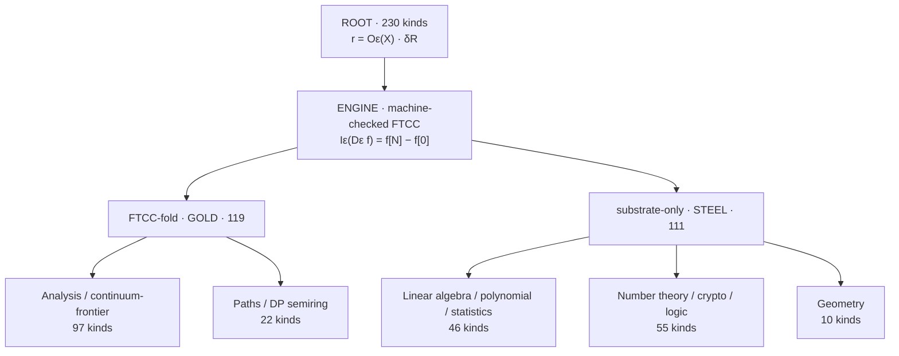

# Native RCP Retained Fold Architecture

## From one readout equation to 230 solver kinds

**Status:** executable architecture + `finite_diagnostic` benchmark  
**Formal root:** FTCC core is machine-checked (`Th_coqc`)  
**Empirical claim:** none  
**External comparison methods:** variable elimination, junction tree, and
tensor-network autodiff remain comparators only

---

## 1. Non-contamination rule

RCP does not contain a junction-tree engine.

The native executor is a **Retained Fold Tree (RFT)** constructed from the
repository's own declared objects:

1. retained distinctions;
2. finite readout boundary;
3. causal closure order;
4. FTCC-style fold;
5. terminal-relevance unfold.

Junction tree remains useful as an external speed and correctness comparator.
Its clique construction, clique calibration, and probabilistic semantics are
not imported into RFT.

This distinction is substantive rather than terminological:

| object | Native RFT | Junction tree |
|---|---|---|
| starting primitive | declared finite readout | factorized probability/potential |
| node | one retained closure event | maximal clique/cluster |
| edge | produced boundary record | clique separator |
| upward action | close one distinction into its boundary | sum-product message |
| downward action | unfold only declared terminal relevance | calibrate clique beliefs |
| default output | named readouts fixed before execution | reusable calibrated marginals |
| probabilistic interpretation | not required | conventional primary use |

The two procedures can coincide extensionally on some finite sum-product
problems. Such agreement is a reconciliation result, not an identity of
foundations.

The same non-contamination rule applies to differentiation. Retained Readout
Pullback extracts shared terminal-environment reuse from reverse-mode
autodiff, but represents sensitivities as declared finite statistics rather
than importing an autodiff tape, general factor adjoints, or tensor-network
semantics. See
[`RCP_RETAINED_READOUT_PULLBACK_STANDALONE.md`](RCP_RETAINED_READOUT_PULLBACK_STANDALONE.md).

---

## 2. Root: every answer is a retained readout

The whole solver catalogue is governed by:

\[
r=O_\varepsilon(X)\cdot\delta_R.
\]

Here:

- \(X\) is the accessible finite record;
- \(\delta_R\) is the retained difference that makes a distinction readable;
- \(O_\varepsilon\) is the declared finite-resolution readout;
- \(r\) is the terminal answer.

This root covers all 230 solver kinds as a principle. It does not mean all
230 kinds use the same low-level arithmetic executor.

---

## 3. Gold engine: FTCC

The machine-checked finite telescoping engine is:

\[
I_\varepsilon(D_\varepsilon f)=f[N]-f[0].
\]

Its computational reading is:

> Close internal distinctions by a finite ordered fold while preserving the
> terminal boundary difference.

FTCC is therefore not restricted to a conventional integral. It supplies the
gold fold pattern whenever an answer is obtained by ordered accumulation,
telescoping, dynamic-programming closure, or semiring path folding.

---

## 4. The 230-kind architecture



### 4.1 FTCC-fold family — gold, 119 kinds

#### Analysis and continuum-frontier — 97 kinds

Finite differences, finite sums, quadrature, limits by stability, ODE/PDE
readouts, transforms, special functions, and related analysis kinds close an
ordered internal tape into a terminal finite value.

#### Paths and dynamic-programming semirings — 22 kinds

Shortest, widest, critical, reachability, and related dynamic programs use the
same fold skeleton over a different algebra:

\[
\operatorname{Fold}_{\oplus,\otimes}
\left(\text{retained local transitions}\right).
\]

The arithmetic changes; the retained closure pattern does not.

### 4.2 Substrate-only family — steel, 111 kinds

These kinds use the retained finite substrate directly and do not require the
FTCC fold to define their primary operation.

#### Linear algebra, polynomial, and statistics — 46 kinds

Finite arrays, exact/rational algebra, recurrence, aggregation, and declared
statistical readouts.

#### Number theory, cryptography, and logic — 55 kinds

Finite divisibility, modular structure, exact integer algorithms, Boolean
closure, SAT, and retained logical verdicts.

#### Geometry — 10 kinds

Exact finite orientation, incidence, distance/readout relations, and
combinatorial geometry.

The count closes:

\[
97+22=119,\qquad 46+55+10=111,\qquad 119+111=230.
\]

---

## 5. Native Retained Fold Tree

Let the declared finite record contain local factors \(F\), distinctions
\(V\), and terminal query \(Q\).

### 5.1 One fold node per closed distinction

For an internal distinction \(v\), let \(B_v\) be the distinctions from its
active records that remain readable after \(v\) closes.

The RFT node is:

\[
\mathcal C_v=(v,B_v,F_v,m_v),
\]

where \(F_v\) is the active local bucket and

\[
m_v(i_{B_v})
=
\sum_{i_v}
\prod_{f\in F_v} f(i_{\operatorname{scope}(f)})
\]

is the retained boundary record produced by the fold.

The node is not a clique. It exists because one distinction was closed and a
specific boundary record survived.

### 5.2 RFT edges are causal record lineage

An edge

\[
\mathcal C_u\longrightarrow\mathcal C_v
\]

exists exactly when \(m_u\) is consumed by the later closure \(\mathcal C_v\).
The edge carries \(m_u\), not a globally calibrated separator potential.

Every generated record has one later consumer under the admitted elimination
order, so the closure lineage is a finite fold tree (or a forest joined by a
virtual scalar root for disconnected records).

### 5.3 Upward FTCC-fold

The upward pass repeatedly applies:

\[
(F_v,v)\mapsto m_v(B_v).
\]

Internal distinction \(v\) disappears from the exposed scope, but its effect
is retained in \(m_v\). This is closure, not erasure.

At the root:

\[
Z=\operatorname{FoldUp}(F).
\]

### 5.4 Downward terminal-relevance unfold

Let \(a_v(B_v)\) be the terminal relevance arriving from the consumer of
\(m_v\). RFT forms the local retained environment:

\[
E_v(i_v,i_{B_v})
=
a_v(i_{B_v})
\prod_{f\in F_v}f(i_{\operatorname{scope}(f)}).
\]

The mass readout of the distinction closed at that node is:

\[
\rho_v(i_v)
=
\sum_{i_{B_v}}E_v(i_v,i_{B_v}).
\]

Its first moment is read directly:

\[
\mu_v
=
\frac{\sum_{i_v}x_v(i_v)\rho_v(i_v)}{Z}.
\]

Only contexts of generated child records are propagated further downward.
Pair-factor adjoints are not requested terminal readouts, so RFT never forms
them.

This is the native information principle:

> Do not propagate influence into a distinction after its contribution to
> every declared terminal readout has already been retained.

### 5.5 Retained Closure Fusion

The optimized executor removes a boundary between consecutive folds only when
admitting the next axis introduces no new distinction into the joined record:

\[
\mathcal F_B
=
I_\varepsilon
\left(\prod_{v\in B}D_v\right)
\Bigm|_{\partial_R B}.
\]

This is **boundary-neutral fusion**, not clique construction.  It is admitted
only when:

1. no intermediate readout was declared;
2. the joined retained scope does not grow;
3. the fused record has at most 16,384 elements;
4. retained closure witnesses fit the separate 4 MiB float64 cache budget.

The structural closure program, factor IDs, output scopes, and readout
reduction axes are compiled once and cached.  On the declared positive
Gauss-weight/exponential factor domain, a child context is recovered from the
retained witness by exact finite quotient rather than by rebuilding sibling
products.  A single full closure takes a specialized direct-readout path with
no artificial context graph.

### 5.6 Retained-first native compilation

The executor absorbs the reusable compiler idea exposed by JAX without
importing JAX or adopting autodiff:

```text
declared topology + readouts
        ↓
native retained structural plan
        ↓
topology-only plan signature
        ↓
compiled finite loops
        ↓
partition + named sensitivities + structural witness
```

The cache identity contains dimension, ordered pair scopes, quadrature order,
and plan version. Numerical coefficients are runtime records and are excluded
from that identity. Therefore changing \(\alpha\) or \(\beta\) does not
replan the closure program, and a same-topology batch reuses one program.

The current CPU loops accept dynamic array lengths, so fixed-size bucketing
would merely introduce padded distinctions. Bucketing is reserved for a
future backend whose recompilation cost is demonstrably larger than packing
and padded execution. This keeps the information rule explicit: do not retain
padding unless it lowers total declared work.

### 5.7 Balanced Retained-Cut Fusion for dense closures

For dense graphs, factor-by-factor closure construction revisits the same
finite configurations. The native dense executor instead partitions axes into
balanced blocks \(L,R\), retains one cross-boundary mass

\[
M_{uv}
=
\exp\!\left(
\log w_L(u)-E_L(u)
+\log w_R(v)-E_R(v)
-x_L(u)^\mathsf{T}B_{LR}x_R(v)
\right),
\]

and reads the partition, within-block statistics, and cross statistics as

\[
Z=\mathbf1^\mathsf{T}M\mathbf1,
\qquad
N_{LR}=X_L^\mathsf{T}MX_R.
\]

For \(d=8,q=4\), the balanced retained boundary is
\(256\times256=65{,}536\) elements. It is admitted only while
\(q^d\le524{,}288\); larger dense programs retain the existing resource-gated
fallback. This is one boundary/readout program, not a Junction Tree: there is
no clique hierarchy, message schedule, or imported elimination semantics.

---

## 6. Executable implementation

The clean native executor is:

```text
benchmarks/retained_fold_tree.py
```

It performs:

1. retained-factor translation;
2. min-fill causal closure ordering;
3. one upward boundary fold;
4. one downward terminal-relevance unfold;
5. direct readout of every eliminated distinction at its own fold node;
6. boundary-neutral closure fusion;
7. a precompiled structural program and budgeted witness cache;
8. separate peak-retained and peak-working ledgers.

The compiled sensitivity executor is
`benchmarks/compiled_retained_readout_pullback.py`. It provides topology-only
plan caching, multi-parameter reuse, and structural witnesses. It does not
import JAX, call autodiff, or call the benchmark junction-tree implementation.
Its dense path uses Balanced Retained-Cut Fusion to read all parameter
statistics from one finite boundary mass.

---

## 7. Direct numerical comparison

Environment:

- Python 3.12;
- NumPy 2.3.5;
- `opt_einsum` 3.4.0;
- Autograd 1.8.0;
- 101 deterministically interleaved primary calls;
- 31 deterministically interleaved width-stress calls;
- tolerance \(10^{-12}\).

Primary sparse 11-dimensional problem:

| method | median complete call | maximum difference versus original RCP |
|---|---:|---:|
| cached-plan junction-tree comparator | **0.269 ms** | \(3.331\times10^{-16}\) |
| **native Retained Closure Fusion** | **0.280 ms** | \(3.331\times10^{-16}\) |
| cold-plan junction-tree comparator | 0.452 ms | \(3.331\times10^{-16}\) |
| query-pruned RCP reverse | 0.584 ms | 0 |
| native one-axis RFT | 0.600 ms | \(1.110\times10^{-16}\) |
| original RCP reverse | 0.698 ms | 0 |
| repeated variable elimination | 1.479 ms | \(1.665\times10^{-16}\) |
| external tensor autodiff | 2.661 ms | \(3.331\times10^{-16}\) |
| full enumeration, one run | 43.674 s | \(1.665\times10^{-16}\) |

The cached-plan junction-tree comparator remains 4.2% faster on this favorable
sparse width-2 case.  Closure Fusion is nevertheless 38% faster than the
cold-plan junction-tree call and 53% faster than one-axis RFT.  Both cached
structural plans are reported so compilation asymmetry is not hidden.

### Width stress

| complete graph | native RCF | cached-plan JT | cold-plan JT | one-axis RFT | tensor autodiff | fastest |
|---|---:|---:|---:|---:|---:|---|
| \(d=5,w=4\) | **0.151 ms** | 0.152 ms | 0.217 ms | 0.355 ms | 1.723 ms | **native RCF** |
| \(d=6,w=5\) | 0.289 ms | **0.288 ms** | 0.380 ms | 0.534 ms | 2.167 ms | statistical tie |
| \(d=7,w=6\) | **0.772 ms** | 0.792 ms | 0.912 ms | 0.969 ms | 2.832 ms | **native RCF** |
| \(d=8,w=7\) | **1.461 ms** | 2.867 ms | 3.025 ms | 2.391 ms | 3.662 ms | **native RCF** |
| \(d=9,w=8\) | **3.982 ms** | 12.088 ms | 12.307 ms | 8.213 ms | 5.324 ms | **native RCF** |

The previous low-dimension deficit is removed: RCF wins at \(d=5\), \(d=7\),
\(d=8\), and \(d=9\), while \(d=6\) differs from cached-plan junction tree by
only 0.3%, below a meaningful implementation-level separation.  At \(d=9\),
the 4 MiB witness budget prevents the downward pass from reconstructing the
two largest closure records, reversing the earlier tensor-autodiff win.

The RFT result is `finite_diagnostic`. It demonstrates a native working
architecture, not a universal speed theorem.

---

## 8. Next native upgrades

The next changes must remain inside the retained-readout derivation:

1. **Readout-selective tree:** construct only folds inside the declared
   terminal relevance cone.
2. **Adaptive memory certificate:** choose the witness budget from an explicit
   caller resource declaration rather than a fixed 4 MiB default.
3. **Workspace certificate:** separately preflight retained storage and local
   working storage.
4. **Formal preservation:** prove one fused closure preserves the boundary readout,
   then prove the full fold tree by finite induction.

External algorithms remain comparators. Any useful performance lesson must be
translated into a retained-information operation and rederived before it
enters the native executor.

---

## 9. Tier boundary

- Root readout stance: `Dr`
- Machine-checked FTCC identity: `Th_coqc`
- Python RFT executor and timing comparison: `finite_diagnostic`
- General optimality or universal superiority: unproved
- Physical-world interpretation: outside this benchmark
