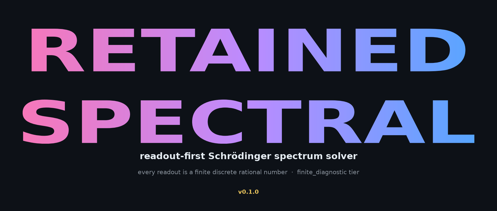

<div align="center">



**A ready-to-use, readout-first solver for 1-D Schrödinger spectra.** _Part of
[Information Discrete Mathematics](../README.md) by Yaoharee Lahtee._

> **This is ONE product of a larger platform — do not infer the project's scope from this folder.**
> The parent project is a **267-kind unified solver** (`idm.solve`) + exact CAS + certified readouts +
> 184 machine-checked Coq theorems. Retained Spectral is its eigenvalue/eigenvector/inertia surface.
> Start at [`../AI_START_HERE.md`](../AI_START_HERE.md) · machine-readable [`../capabilities.json`](../capabilities.json) · API map [`../API_INDEX.md`](../API_INDEX.md).

**[▶ Reproduce the competition in one click (Google Colab)](https://colab.research.google.com/github/morrocwi/information-discrete-math/blob/main/retained_spectral/reproduce.ipynb)**

</div>

---

Retained Spectral computes the lowest requested energy levels of

```
H = -1/2 d²/dx² + V(x)
```

from **raw input only** — `(potential family, finite parameters, number of modes, tolerance)`. No
window, mesh, reference eigenvalue, or pre-built operator is supplied. The native method, **Retained
Multilevel Sturm (RMS)**, discovers its own finite well, admits the boundaries with a finite decay
gate, brackets each level by a signed Sturm count, and refines on a multilevel mesh until mesh and
window witnesses fit the declared tolerance.

Every returned object is a finite rational-arithmetic readout; the verdict tier is
`finite_diagnostic` — a discrete diagnostic agreement, **not** a continuum-limit proof and **not** an
empirical-physics claim.

## Folder guide

**What this folder does.** Everything above (`solve`/`make_problem`/`examples`) is the top-level
product surface. Under the hood: `engine.py` holds the native Retained Multilevel Sturm (RMS) kernel
plus a reference-blind SciPy comparison path, including
`native_eigvals_from_tridiagonal(diagonal, off_diagonal, k, energy_tolerance)` for kernel-only timing
on a PREBUILT tridiagonal operator; `inertia.py` provides the standalone Sylvester inertia counter
(`count_below_banded`, `resolved_count_below`, plus dense variants) — exact eigenvalue counts below a
shift with no eigenvector ever formed; `retained_mode.py` provides Retained Mode Readout (RMR) —
`modes(d, e, lams, rho=1e-10, ...)` recovers eigenvectors from the retained pivot record the Sturm
bisection already computed, no separate inverse iteration; `competition/` holds the benchmark runner,
chart generator, and `credibility_audit`; `results/` holds the recorded `competition_results.json`.

**What NOT to import directly.** `retained_mode.py`'s `_pivots_py`/`_generate_py`/`_ldl_solve_py` are
internal per-step helpers, not a stable contract. `competition/mrrr.py` / `bench_mrrr.py` are an
optional comparator (skipped cleanly with no resolvable BLAS `dstemr`), not a required dependency.

**Limits (beyond the honesty boundary above).** `inertia.py`'s pivot count is an exact eigenvalue
count for `M` positive definite (and empirically for positive semidefinite `M`); for indefinite `M`
it is the inertia of `K − σM`, **not** the pencil eigenvalue count, and must not be read as one. The
inertia method's competitive regime is narrow-banded operators, not dense/3-D-solid ones.

## Install

```bash
# solver only
pip install "information-discrete-math[spectral] @ git+https://github.com/morrocwi/information-discrete-math"
# solver + benchmark + chart tooling (adds matplotlib, jax)
pip install "information-discrete-math[spectral-bench] @ git+https://github.com/morrocwi/information-discrete-math"
```

## API

```python
import retained_spectral as rs

# 1) solve a bundled example
result = rs.solve(rs.examples()["harmonic_low4"])
print(result.status)   # "ACCEPT"
print(result.values)   # (0.5, 1.5, 2.5, 3.5)

# 2) build your own problem
problem = rs.make_problem(
    name="my_harmonic",
    family="harmonic",              # one of rs.POTENTIAL_FAMILIES
    parameters={"omega": 2.0, "center": 0.0},
    modes=3,
    tolerance=1e-8,
)
print(rs.solve(problem).values)     # (1.0, 3.0, 5.0)
```

| Function | Purpose |
| --- | --- |
| `solve(problem) -> SpectralResult` | Lowest requested levels; `status` is `ACCEPT`/`HOLD`. |
| `make_problem(name, family, parameters, modes, tolerance)` | Build a `SpectralProblem` from a dict. |
| `examples() -> dict[str, SpectralProblem]` | The seven bundled benchmark problems. |
| `POTENTIAL_FAMILIES` | `harmonic`, `poschl_teller`, `morse`, `factorized_sextic`, `pure_quartic`. |

`SpectralResult` carries `values`, `status`, `window`, `finest_intervals`, `solve_count`,
`diagnostic_bounds`, `elapsed_seconds`, `tier`, and `reason`.

## Reproduce the competition

```bash
python3 -m retained_spectral.competition.run      # writes results/competition_results.json (measured here)
python3 -m retained_spectral.competition.chart     # writes assets/retained_spectral_{hero,detail}.png
python3 -m pytest tests/test_retained_spectral.py -q
```

Two independent measurements are recorded:

1. **Same-operator executor audit** *(the credible comparison)* — native and every standard eigensolver
   solve one **identical** native-built operator: `scipy.linalg.eigh_tridiagonal`, `scipy.linalg.eigh`
   (dense), `numpy.linalg.eigvalsh` (dense), `scipy.sparse.linalg.eigsh` (ARPACK), and
   `jax.numpy.linalg.eigvalsh` (dense). Only the solve kernel differs; eigenvalues are cross-checked.
   This isolates the solver and removes any "the competitor was handicapped" objection. (Dense-route
   wall-clock depends on the linked BLAS/LAPACK backend.)
2. **End-to-end independent pipelines** *(full disclosure)* — the native pipeline and an independent
   SciPy pipeline each receive the same raw input and own their entire schedule. The SciPy competitor
   here is **our own construction**, so it is reported as supplementary, not as the headline.

Correctness is checked against **published/analytic eigenvalues** consulted only *after* both solvers
return.

## Honesty boundary

- The continuum / infinite-line expression only *names the target*. Every executable object is a
  finite array; every verdict is `finite_diagnostic`.
- Beating a dense eigensolver by ~10³× is a **structural** fact (requested-only O(k·N) Sturm vs a dense
  O(N³) whole-spectrum route), not a universal "quantum advantage" claim.
- References are comparators, never authorities. Agreement establishes readout agreement within the
  stated tolerance — nothing about physical ontology.

MIT © **Yaoharee Lahtee**. AI-assisted; the core stance and results are the author's.
